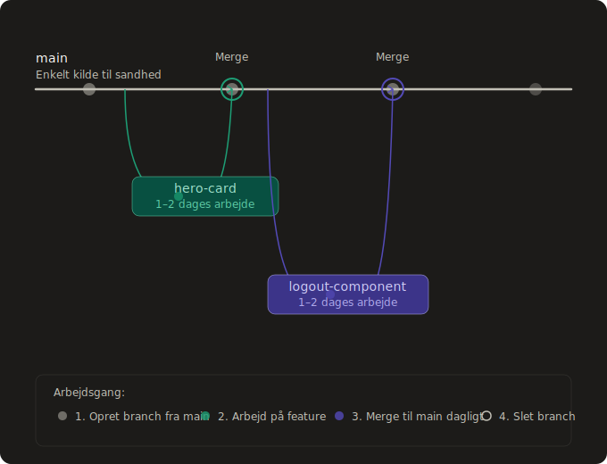

## Branching strategi

Branching er en funktion i versionskontrolsystemer som Git der gør det muligt at arbejde på kode i isolation fra hovedkodebasen. En branch er en kopi af koden hvor der kan foretages ændringer uden at påvirke den øvrige kodebase. Når ændringerne er klar, merges branchen tilbage ind i hovedgrenen. Branch strategi henviser til de regler og konventioner et team følger for hvordan og hvornår branches oprettes og merges.

### Hvordan bruges branching?

I projektet anvendes **Trunk-Based Development** som branch strategi. I Trunk-Based Development er `main` den primære branch. Der arbejdes i korte feature branches der holdes til mindre afgrænsede features eller views, og som merges tilbage i `main` når featuren er færdig, minimum én gang dagligt når der arbejdes aktivt på projektet.

**Et eksempel:**

1. En ny branch oprettes til en specifik feature, eksempelvis `BB-homepage`
2. Der arbejdes på featuren i branchen
3. Når featuren er færdig merges branchen ind i `main`
4. Branchen slettes og en ny oprettes til næste feature

Det er valgt ikke at anvende feature toggles i projektet. I stedet holdes branches tilstrækkeligt små og kortlivede til at de kan merges uden at introducere ufærdig funktionalitet i `main`.

### Erfaringer med Trunk-Based Development

Trunk-Based Development har haft en positiv effekt på samarbejdet i projektet. Ved konsekvent at holde branches til mindre features og merge dagligt sikres det at alle teammedlemmer altid arbejder med den nyeste version af kodebasen, hvilket minimerer risikoen for at arbejde oven i hinanden og lave dobbeltarbejde.

Der var indledningsvis en indlæringsperiode hvor strategien skulle indøves. Det blev hurtigt tydeligt at afvigelser fra strategien, eksempelvis ved at arbejde i større og længerelevende branches, resulterede i flere merge konflikter. Dette bekræftede værdien af at holde sig til små og hyppigt mergede branches, og har gjort teamet mere bevidst om at følge strategien konsekvent.